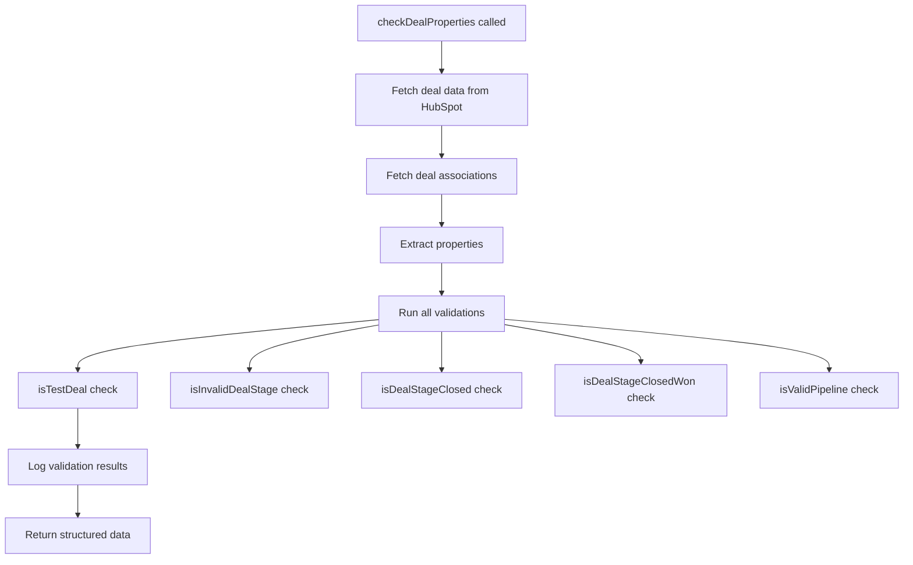

# Comprehensive Guide: `checkDealProperties` Function & Deal Service

## 📋 **Function Overview**

The `checkDealProperties` function is the **central validation and data aggregation function** in the Deal Service. It serves as the single source of truth for determining a deal's current state, eligibility for processing, and extracting all necessary information for HubSpot-NetSuite synchronization.

**Location**: `src/services/deal.service.ts:10-79`
**Purpose**: Validates deal properties and applies business rules to determine processing eligibility

## 🏗️ **System Architecture & Data Flow**

### **Data Sources**
```
HubSpot CRM API → hubspotService → checkDealProperties → Business Logic → Return Structured Data
```

### **API Endpoints Used**
1. **Primary Data**: `GET /crm/v3/objects/deals/{dealId}` - Fetches complete deal properties
2. **Associations**: `GET /crm/v4/objects/deals/{dealId}/associations/` - Fetches related records

### **Properties Fetched from HubSpot**
```typescript
// From line 36-42 in hubspot.service.ts
properties: [
  'dealname', 'amount', 'pipeline', 'dealstage',
  'hs_analytics_source', 'hs_deal_stage_probability',
  'createdate', 'hs_lastmodifieddate', 'hs_object_id',
  'netsuite_id', 'opportunity_number', 'purchasing_contract_id'
]
```

## 🔍 **Detailed Function Breakdown**

### **Function Signature**
```typescript
async checkDealProperties(dealId: string): Promise<{
  isDealTest: boolean;           // 🧪 Test deal detection
  isInvalidStage: boolean;       // ❌ Invalid stage check
  dealStageClosed: boolean;      // 🔒 Closed deal detection
  dealStageClosedWon: boolean;   // ✅ Closed-won detection
  dealPipelineValid: boolean;    // 🛤️ Pipeline validation
  opportunityNumber: string;     // 📋 ERP opportunity number
  netsuiteId: string;           // 🔗 NetSuite integration ID
  purchasingContractId: string;  // 📄 Contract reference
  dealLineItems: DealAssociationData[];    // 📦 Associated products
  dealCompanies: DealAssociationData[];    // 🏢 Associated companies
  createdAt: string;             // 📅 Creation timestamp
  dealUpdatedById: string;       // 👤 Last updater
}>
```

## 🎯 **Validation Methods Explained**

### **1. `isTestDeal()` - Test Deal Detection**
**Purpose**: Identifies deals that should NOT be synchronized to production systems

```typescript
private isTestDeal(dealname: string): boolean {
  const testKeywords = ['test', 'testing', 'demo', 'sample', 'vivacity'];
  return testKeywords.some(keyword =>
    dealname.toLowerCase().includes(keyword.toLowerCase())
  );
}
```

**Business Logic**:
- **Why?** Prevents test/sandbox data from polluting production NetSuite
- **Keywords**: `'test', 'testing', 'demo', 'sample', 'vivacity'`
- **Case-insensitive**: `'TEST DEAL'` → `true`
- **Interview Answer**: "This prevents test data from being synchronized to the production ERP system"

### **2. `isInvalidDealStage()` - Invalid Stage Detection**
**Purpose**: Identifies deal stages that should NOT be processed

```typescript
private isInvalidDealStage(dealstage: string): boolean {
  const invalidStages = ['7', 'closedlost', 'dead'];
  return invalidStages.includes(dealstage.toLowerCase());
}
```

**Business Logic**:
- **Stage '7'**: NetSuite stage for Closed Lost
- **Stage 'closedlost'**: HubSpot stage for Closed Lost
- **Stage 'dead'**: Dead/inactive deals
- **Why?** These stages represent completed deals that shouldn't be modified

### **3. `isDealStageClosed()` - Closed Deal Detection**
**Purpose**: Identifies deals in terminal stages

```typescript
private isDealStageClosed(dealstage: string): boolean {
  const closedStages = ['closedwon', 'closedlost', '6', '7'];
  return closedStages.includes(dealstage.toLowerCase());
}
```

**Business Logic**:
- **HubSpot stages**: `'closedwon'`, `'closedlost'`
- **NetSuite stages**: `'6'` (Closed Won), `'7'` (Closed Lost)
- **Why?** Used to determine if deal processing should stop

### **4. `isDealStageClosedWon()` - Closed-Won Detection**
**Purpose**: Specifically identifies successful deals

```typescript
private isDealStageClosedWon(dealstage: string): boolean {
  const closedWonStages = ['closedwon', '6'];
  return closedWonStages.includes(dealstage.toLowerCase());
}
```

**Business Logic**:
- **HubSpot**: `'closedwon'`
- **NetSuite**: `'6'` (Closed Won)
- **Why?** Used for success metrics and final processing

### **5. `isValidPipeline()` - Pipeline Validation**
**Purpose**: Ensures deal belongs to correct sales pipeline

```typescript
private isValidPipeline(pipeline: string): boolean {
  const validPipelines = ['default', 'sales_pipeline', '36643521'];
  return validPipelines.includes(pipeline) || !pipeline;
}
```

**Business Logic**:
- **Valid pipelines**: `'default'`, `'sales_pipeline'`, `'36643521'`
- **Empty allowed**: `!pipeline` allows flexibility for new deals
- **Why?** Ensures only deals from correct sales processes are synchronized

## 📊 **Return Values Explained**

### **Boolean Flags**
| Field | Meaning | Usage |
|-------|---------|-------|
| `isDealTest` | Deal name contains test keywords | Skip synchronization |
| `isInvalidStage` | Deal in invalid terminal stage | Skip processing |
| `dealStageClosed` | Deal in any closed stage | Final state check |
| `dealStageClosedWon` | Deal in closed-won stage | Success validation |
| `dealPipelineValid` | Deal in valid pipeline | Pipeline compliance |

### **Identifier Fields**
| Field | Source | Purpose |
|-------|--------|---------|
| `opportunityNumber` | `dealProperties.opportunity_number` | ERP system reference |
| `netsuiteId` | `dealProperties.netsuite_id` | NetSuite integration ID |
| `purchasingContractId` | `dealProperties.purchasing_contract_id` | Contract reference |
| `dealUpdatedById` | `dealProperties.primaryContactId` | Last modifier tracking |

### **Association Data**
| Field | API Endpoint | Purpose |
|-------|--------------|---------|
| `dealLineItems` | `/associations/line_items` | Products/services in deal |
| `dealCompanies` | `/associations/companies` | Associated company records |

## 🔄 **Function Flow & Usage**

### **Execution Flow**


### **How It's Used in `syncDealToNetSuite`**

```typescript
// Lines 148-166 in deal.service.ts
const dealValidation = await this.checkDealProperties(dealId);

// Business rule enforcement
if (dealValidation.isDealTest) {
  console.log(`Skipping test deal ${dealId}`);
  return null; // 🚫 Don't sync test deals
}

if (dealValidation.isInvalidStage) {
  console.log(`Skipping deal ${dealId} due to invalid stage`);
  return null; // 🚫 Don't process invalid stages
}

if (!dealValidation.dealPipelineValid) {
  console.log(`Skipping deal ${dealId} due to invalid pipeline`);
  return null; // 🚫 Don't process wrong pipeline
}
```

## 🎯 **Interview Preparation Guide**

### **Key Questions to Expect**

1. **"What does this function do?"**
   - *"This function validates deal properties and applies business rules to determine if a deal should be synchronized from HubSpot to NetSuite"*

2. **"Where does the data come from?"**
   - *"Data comes from HubSpot CRM API endpoints - deal properties and associations are fetched using the hubspotService"*

3. **"Why do we check for test deals?"**
   - *"To prevent test/sandbox data from being synchronized to the production ERP system, maintaining data integrity"*

4. **"What are the business rules being enforced?"**
   - *"Deals must not be test deals, must not be in invalid stages (7, closedlost, dead), and must be in valid pipelines"*

5. **"How do you know if a deal is closed-won?"**
   - *"By checking if the deal stage is either 'closedwon' (HubSpot) or '6' (NetSuite stage)"*

### **Critical Understanding**
- **Single Responsibility**: This function ONLY validates and extracts data
- **Data Aggregation**: Combines deal properties + associations in one call
- **Business Logic Centralization**: All validation rules are in one place
- **Performance**: Makes only 2 API calls (deal + associations) instead of multiple

This function is the **foundation** of the entire HubSpot-NetSuite integration system!

## 📁 **File Location**
**Created**: `src/services/README_DealService.md`
**Related Files**:
- `src/services/deal.service.ts` - Main implementation
- `src/services/hubspot.service.ts` - Data source service
- `src/types.ts` - TypeScript type definitions


// Points
# Comprehensive Guide: `checkDealProperties` Function & Deal Service

## 📋 **Function Overview**

The `checkDealProperties` function is the **central validation and data aggregation function** in the Deal Service. It serves as the single source of truth for determining a deal's current state, eligibility for processing, and extracting all necessary information for HubSpot-NetSuite synchronization.

**Location**: `src/services/deal.service.ts:10-79`
**Purpose**: Validates deal properties and applies business rules to determine processing eligibility

## 🏗️ **System Architecture & Data Flow**

### **Data Sources**
```
HubSpot CRM API → hubspotService → checkDealProperties → Business Logic → Return Structured Data
```

### **API Endpoints Used**
1. **Primary Data**: `GET /crm/v3/objects/deals/{dealId}` - Fetches complete deal properties
2. **Associations**: `GET /crm/v4/objects/deals/{dealId}/associations/` - Fetches related records

### **Properties Fetched from HubSpot**
```typescript
// From line 36-42 in hubspot.service.ts
properties: [
  'dealname', 'amount', 'pipeline', 'dealstage',
  'hs_analytics_source', 'hs_deal_stage_probability',
  'createdate', 'hs_lastmodifieddate', 'hs_object_id',
  'netsuite_id', 'opportunity_number', 'purchasing_contract_id'
]
```

## 🔍 **Detailed Function Breakdown**

### **Function Signature**
```typescript
async checkDealProperties(dealId: string): Promise<{
  isDealTest: boolean;           // 🧪 Test deal detection
  isInvalidStage: boolean;       // ❌ Invalid stage check
  dealStageClosed: boolean;      // 🔒 Closed deal detection
  dealStageClosedWon: boolean;   // ✅ Closed-won detection
  dealPipelineValid: boolean;    // 🛤️ Pipeline validation
  opportunityNumber: string;     // 📋 ERP opportunity number
  netsuiteId: string;           // 🔗 NetSuite integration ID
  purchasingContractId: string;  // 📄 Contract reference
  dealLineItems: DealAssociationData[];    // 📦 Associated products
  dealCompanies: DealAssociationData[];    // 🏢 Associated companies
  createdAt: string;             // 📅 Creation timestamp
  dealUpdatedById: string;       // 👤 Last updater
}>
```

## 🎯 **Validation Methods Explained**

### **1. `isTestDeal()` - Test Deal Detection**
**Purpose**: Identifies deals that should NOT be synchronized to production systems

```typescript
private isTestDeal(dealname: string): boolean {
  const testKeywords = ['test', 'testing', 'demo', 'sample', 'vivacity'];
  return testKeywords.some(keyword => 
    dealname.toLowerCase().includes(keyword.toLowerCase())
  );
}
```

**Business Logic**:
- **Why?** Prevents test/sandbox data from polluting production NetSuite
- **Keywords**: `'test', 'testing', 'demo', 'sample', 'vivacity'`
- **Case-insensitive**: `'TEST DEAL'` → `true`
- **Interview Answer**: "This prevents test data from being synchronized to the production ERP system"

### **2. `isInvalidDealStage()` - Invalid Stage Detection**
**Purpose**: Identifies deal stages that should NOT be processed

```typescript
private isInvalidDealStage(dealstage: string): boolean {
  const invalidStages = ['7', 'closedlost', 'dead'];
  return invalidStages.includes(dealstage.toLowerCase());
}
```

**Business Logic**:
- **Stage '7'**: NetSuite stage for Closed Lost
- **Stage 'closedlost'**: HubSpot stage for Closed Lost  
- **Stage 'dead'**: Dead/inactive deals
- **Why?** These stages represent completed deals that shouldn't be modified

### **3. `isDealStageClosed()` - Closed Deal Detection**
**Purpose**: Identifies deals in terminal stages

```typescript
private isDealStageClosed(dealstage: string): boolean {
  const closedStages = ['closedwon', 'closedlost', '6', '7'];
  return closedStages.includes(dealstage.toLowerCase());
}
```

**Business Logic**:
- **HubSpot stages**: `'closedwon'`, `'closedlost'`
- **NetSuite stages**: `'6'` (Closed Won), `'7'` (Closed Lost)
- **Why?** Used to determine if deal processing should stop

### **4. `isDealStageClosedWon()` - Closed-Won Detection**
**Purpose**: Specifically identifies successful deals

```typescript
private isDealStageClosedWon(dealstage: string): boolean {
  const closedWonStages = ['closedwon', '6'];
  return closedWonStages.includes(dealstage.toLowerCase());
}
```

**Business Logic**:
- **HubSpot**: `'closedwon'`
- **NetSuite**: `'6'` (Closed Won)
- **Why?** Used for success metrics and final processing

### **5. `isValidPipeline()` - Pipeline Validation**
**Purpose**: Ensures deal belongs to correct sales pipeline

```typescript
private isValidPipeline(pipeline: string): boolean {
  const validPipelines = ['default', 'sales_pipeline', '36643521'];
  return validPipelines.includes(pipeline) || !pipeline;
}
```

**Business Logic**:
- **Valid pipelines**: `'default'`, `'sales_pipeline'`, `'36643521'`
- **Empty allowed**: `!pipeline` allows flexibility for new deals
- **Why?** Ensures only deals from correct sales processes are synchronized

## 📊 **Return Values Explained**

### **Boolean Flags**
| Field | Meaning | Usage |
|-------|---------|-------|
| `isDealTest` | Deal name contains test keywords | Skip synchronization |
| `isInvalidStage` | Deal in invalid terminal stage | Skip processing |
| `dealStageClosed` | Deal in any closed stage | Final state check |
| `dealStageClosedWon` | Deal in closed-won stage | Success validation |
| `dealPipelineValid` | Deal in valid pipeline | Pipeline compliance |

### **Identifier Fields**
| Field | Source | Purpose |
|-------|--------|---------|
| `opportunityNumber` | `dealProperties.opportunity_number` | ERP system reference |
| `netsuiteId` | `dealProperties.netsuite_id` | NetSuite integration ID |
| `purchasingContractId` | `dealProperties.purchasing_contract_id` | Contract reference |
| `dealUpdatedById` | `dealProperties.primaryContactId` | Last modifier tracking |

### **Association Data**
| Field | API Endpoint | Purpose |
|-------|--------------|---------|
| `dealLineItems` | `/associations/line_items` | Products/services in deal |
| `dealCompanies` | `/associations/companies` | Associated company records |

## 🔄 **Function Flow & Usage**

### **Execution Flow**


### **How It's Used in `syncDealToNetSuite`**

```typescript
// Lines 148-166 in deal.service.ts
const dealValidation = await this.checkDealProperties(dealId);

// Business rule enforcement
if (dealValidation.isDealTest) {
  console.log(`Skipping test deal ${dealId}`);
  return null; // 🚫 Don't sync test deals
}

if (dealValidation.isInvalidStage) {
  console.log(`Skipping deal ${dealId} due to invalid stage`);
  return null; // 🚫 Don't process invalid stages
}

if (!dealValidation.dealPipelineValid) {
  console.log(`Skipping deal ${dealId} due to invalid pipeline`);
  return null; // 🚫 Don't process wrong pipeline
}
```

## 🎯 **Interview Preparation Guide**

### **Key Questions to Expect**

1. **"What does this function do?"**
   - *"This function validates deal properties and applies business rules to determine if a deal should be synchronized from HubSpot to NetSuite"*

2. **"Where does the data come from?"**
   - *"Data comes from HubSpot CRM API endpoints - deal properties and associations are fetched using the hubspotService"*

3. **"Why do we check for test deals?"**
   - *"To prevent test/sandbox data from being synchronized to the production ERP system, maintaining data integrity"*

4. **"What are the business rules being enforced?"**
   - *"Deals must not be test deals, must not be in invalid stages (7, closedlost, dead), and must be in valid pipelines"*

5. **"How do you know if a deal is closed-won?"**
   - *"By checking if the deal stage is either 'closedwon' (HubSpot) or '6' (NetSuite stage)"*

### **Critical Understanding**
- **Single Responsibility**: This function ONLY validates and extracts data
- **Data Aggregation**: Combines deal properties + associations in one call
- **Business Logic Centralization**: All validation rules are in one place
- **Performance**: Makes only 2 API calls (deal + associations) instead of multiple

This function is the **foundation** of the entire HubSpot-NetSuite integration system!


